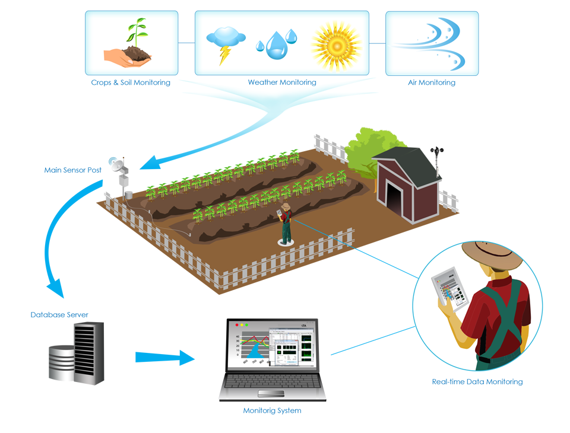

<!--
*** Thanks for checking out the Best-README-Template. If you have a suggestion
*** that would make this better, please fork the repo and create a pull request
*** or simply open an issue with the tag "enhancement".
*** Don't forget to give the project a star!
*** Thanks again! Now go create something AMAZING! :D
-->

<!-- PROJECT SHIELDS -->
<!--
*** I'm using markdown "reference style" links for readability.
*** Reference links are enclosed in brackets [ ] instead of parentheses ( ).
*** See the bottom of this document for the declaration of the reference variables
*** for contributors-url, forks-url, etc. This is an optional, concise syntax you may use.
*** https://www.markdownguide.org/basic-syntax/#reference-style-links
-->

<!-- PROJECT LOGO -->
 

 

  <h3 align="center">DatafestAfrica Datathon 2023 - Data Engineering Project</h3>

  

    A wrap-up project for the 3-day DatafestAfrica Datathon 2023!
     
    <a href="https://github.com/OLAMIDE100/DATAWIZ"><strong>Explore the docs »</strong></a>
     
     
    ·
   
  

<!-- TABLE OF CONTENTS -->

  
Table of Contents

  <ol>
    <li>
      <a href="#about-the-project">About The Project</a>
      <ul>
        <li><a href="#built-with">Built With</a></li>
        <li><a href="#architecture">Architecture</a></li>
      </ul>
    </li>
    <li><a href="#usage">Usage</a></li>
    <li><a href="#roadmap">Roadmap</a></li>
    <li><a href="#pipeline">Pipeline</a></li>
   <li>
      <a href="#deliverables">Deliverables</a>
      <ul>
        <li><a href="#jobs">Jobs</a></li>
        <li><a href="#environments">Environments</a></li>
        <li><a href="#runs">Runs</a></li>
      </ul>
    </li>
    
    
  </ol>

<!-- ABOUT THE PROJECT -->
## About The Project

  <h1>Agricultural Monitoring Systems</h1>
  
  
 

Our business operates in the agricultural sector, where monitoring various environmental conditions and sensor data is crucial for optimizing crop yields and ensuring sustainable farming practices. This datathon is aligned with our commitment to leverage data engineering to streamline the processing and analysis of agricultural data.

(<a href="#top">back to top</a>)

### Architecture

### Built With

Language, frameworks, libraries, Services and Tools used to bootstrap this project.

* DBT 
* Snowflake
* GitHub
* SQL
* Jinja Template

(<a href="#top">back to top</a>)

<!-- USAGE EXAMPLES -->
## Usage

This dataset simulates real-time agricultural sensor data, providing a rich source of information to design and construct a robust data engineering solution. The primary objective of this project is to extract, transform, and load (ETL) the raw sensor data into structured fact and dimension tables within our snowflake data warehouse.

(<a href="#top">back to top</a>)

<!-- ROADMAP -->
## Roadmap

- [x] Create a Snowflakes Account
- [x] Setup DBT cloud or core using the snowflake as its warehouse
- [x] Data Modelling (logical and business)
- [x] Develop
- [x] Test and Documentation
- [x] Create Jobs
- [x] Deploy to Production

<!-- Pipeline -->
## Pipeline

## Deliverables

### Jobs

### Environments

### Runs

